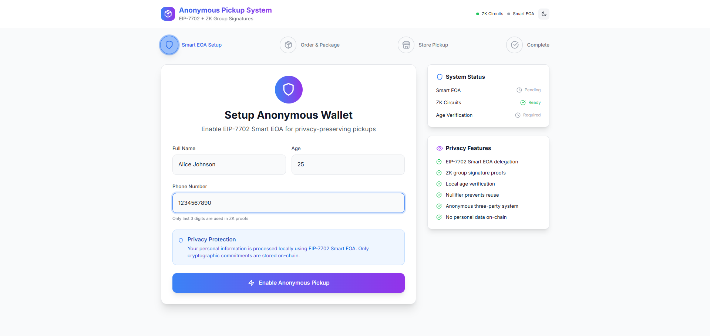
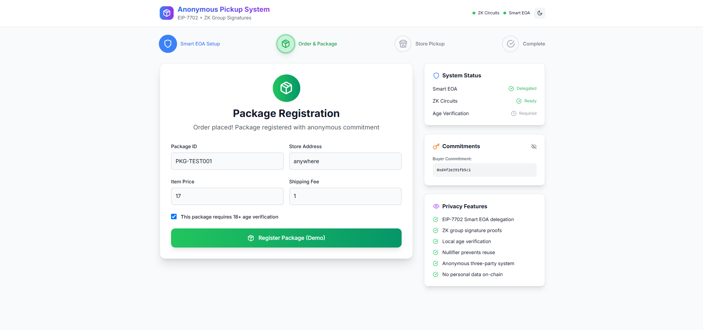
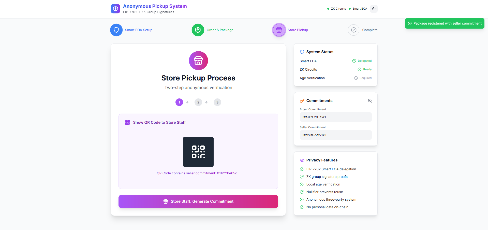
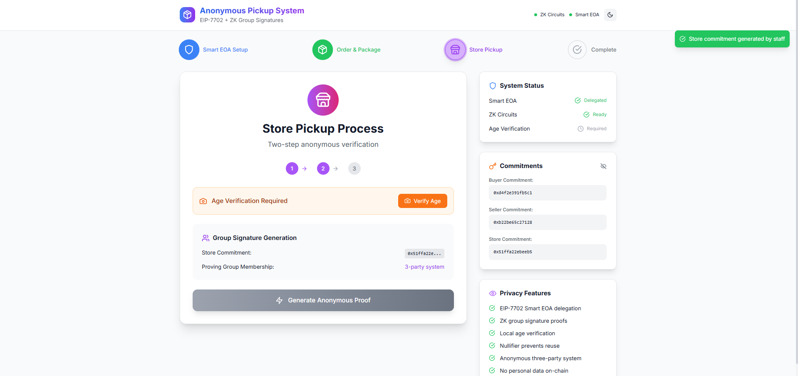
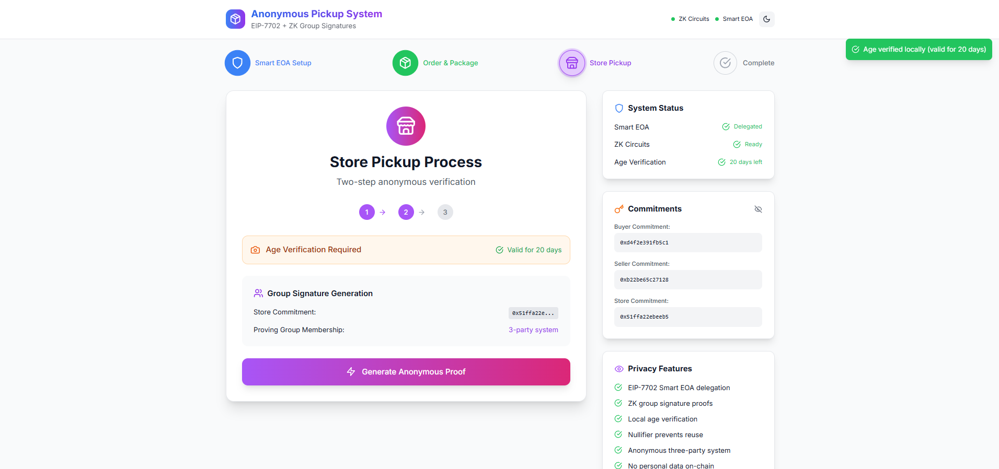
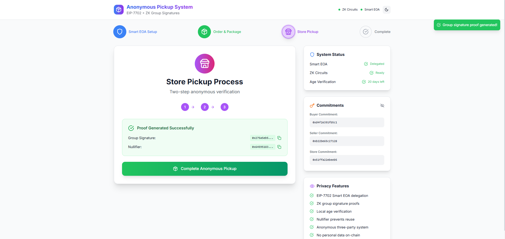
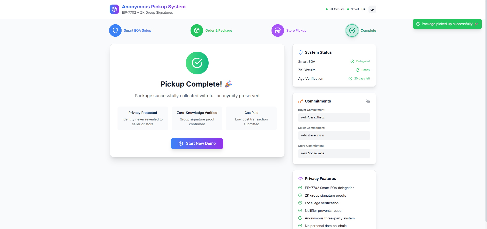

# Anonymous Package Pickup System

> **Privacy-First E-commerce**: A zero-knowledge proof system that enables completely anonymous package pickups using EIP-7702 account abstraction and cryptographic commitments.

## 🔗 Project Links

- **GitHub Repository**: [https://github.com/ButterJ1/anonymous-pickup-systemv3.git](https://github.com/ButterJ1/anonymous-pickup-systemv3.git)
- **Presentation**: Available in-app via Slide component (see switching instructions below)
- **Video Demo**: *Not available - recording was lost due to technical issues, but this README provides a complete walkthrough of system functionality*

## 📸 System Screenshots


*Alice setting up her anonymous identity with privacy-preserving commitments*


*The cryptographic dance between buyer, seller, and store commitments*





*Alice's phone generating mathematical proof of authorization*


*Successful anonymous package pickup with no personal data shared*

> **Note**: Add your actual screenshots to `./docs/screenshots/` directory

## 🎯 What This Project Does

Imagine Alice wants to buy something online but doesn't want to give her personal information to the seller or store. With our system, she can pick up her package completely anonymously.

**The Magic**: Alice's personal data never leaves her device. Instead, we generate cryptographic commitments that mathematically represent Alice without containing any of her actual information. Even if Bob (seller) and Charlie (store clerk) collaborate, they can't reverse-engineer Alice's identity from these commitments.

## 🏗️ System Architecture

This system demonstrates three cutting-edge technologies working together:

1. **EIP-7702 Account Abstraction** - Enables sophisticated privacy features with existing wallets
2. **Zero-Knowledge Proofs** - Allows Alice to prove she's authorized without revealing who she is  
3. **Cryptographic Commitments** - Creates anonymous identities that can't be reverse-engineered

## 🚀 Available Components

The project includes 4 different interfaces you can explore:

### 1. `AnonymousPickupSystem` (Main System)
- **Status**: 🚧 Under Maintenance
- **Description**: Full integration with contracts and circuits
- **Current Issue**: Contract interaction challenges with getBuyerCommitment() function

### 2. `demo` (Working Demo)
- **Status**: ✅ Functional
- **Description**: Complete working demonstration of the privacy flow
- **Features**: 
  - Identity generation with graceful EIP-7702 fallbacks
  - Cryptographic commitment creation
  - Three-party verification system

### 3. `Slide` (Presentation Mode)
- **Status**: 📊 Ready
- **Description**: Interactive presentation explaining the system
- **Use Case**: Perfect for demonstrations and talks

### 4. `Flow` (Technical Diagrams)
- **Status**: 📋 Educational
- **Description**: Visual flow diagrams of EIP-7702, ZKP, and system interactions
- **Use Case**: Understanding the technical architecture

## 🔄 Switching Between Components

In `app/page.tsx`, comment/uncomment the desired component and its corresponding import:

### For Working Demo (Default):
```typescript
'use client'

// import AnonymousPickupSystem from '../src/components/AnonymousPickupSystem'
import AnonymousPickupSystem from '../src/components/demo'
// import AnonymousPickupPresentation from '../src/components/Slide'
// import SystemFlowDiagram from '../src/components/Flow'

export default function Home() {
  return <AnonymousPickupSystem />
  // return <AnonymousPickupPresentation />
  // return <SystemFlowDiagram />
}
```

### For Presentation Mode:
```typescript
'use client'

// import AnonymousPickupSystem from '../src/components/AnonymousPickupSystem'
// import AnonymousPickupSystem from '../src/components/demo'
import AnonymousPickupPresentation from '../src/components/Slide'
// import SystemFlowDiagram from '../src/components/Flow'

export default function Home() {
  // return <AnonymousPickupSystem />
  return <AnonymousPickupPresentation />
  // return <SystemFlowDiagram />
}
```

### For Flow Diagrams:
```typescript
'use client'

// import AnonymousPickupSystem from '../src/components/AnonymousPickupSystem'
// import AnonymousPickupSystem from '../src/components/demo'
// import AnonymousPickupPresentation from '../src/components/Slide'
import SystemFlowDiagram from '../src/components/Flow'

export default function Home() {
  // return <AnonymousPickupSystem />
  // return <AnonymousPickupPresentation />
  return <SystemFlowDiagram />
}
```

## ⚙️ Setup Instructions

### Prerequisites
- Node.js (v18 or higher)
- npm or yarn
- MetaMask or compatible wallet

### Installation & Setup

1. **Initialize the project**
   ```bash
   npm init
   ```

2. **Build the ZK circuits**
   ```bash
   npm run build-circuits
   ```

3. **Deploy contracts** (choose one):

   **For Local Development:**
   ```bash
   # Start local Hardhat node first
   npx hardhat node
   
   # Then deploy to local network
   npm run deploy:local
   ```

   **For Zircuit Network:**
   ```bash
   npm run deploy:zircuit
   ```

   **For Sepolia Testnet:**
   ```bash
   npm run deploy:sepolia
   ```

4. **Start the development server**
   ```bash
   npm run dev
   ```

5. **Open your browser**
   ```
   http://localhost:3000
   ```

## 🎥 Visual Demo (README as Video Alternative)

Since our recorded demo was lost due to technical issues, this README serves as a comprehensive walkthrough of the system. The screenshots above show the key moments in Alice's anonymous pickup journey:

### Demo Flow Walkthrough:

1. **Identity Setup** → Alice enters real info, system generates anonymous commitments
2. **Order Processing** → Bob sees only cryptographic commitment, not Alice's identity  
3. **Store Arrival** → Charlie generates store commitment when Alice shows QR code
4. **ZK Proof Magic** → Alice proves she's authorized without revealing she's the buyer
5. **Package Pickup** → Successful anonymous transaction with full privacy preserved

Each screenshot captures the privacy-preserving technology in action, showing how personal data stays on Alice's device while still enabling secure, verified transactions.

## 🔐 How the Privacy Magic Works

### The Three-Party Dance

1. **Alice (Buyer)** generates a commitment: `hash(secret, nameHash, phoneLastThree, nonce)`
2. **Bob (Seller)** only sees Alice's commitment, not her identity
3. **Charlie (Store)** generates a third commitment when Alice arrives
4. **Alice proves** she knows the secret behind one of the three commitments using ZK proofs

### What Each Party Sees

**Alice knows:**
- Her personal information (stays on her device)
- All three commitments
- She successfully picked up her package

**Bob (Seller) knows:**
- Someone with commitment `0x1a2b3c4d...` bought his product
- He got paid
- The package was picked up

**Charlie (Store) knows:**
- Someone with the right proof picked up package `PKG-ABC123`
- Age requirements were verified (if applicable)
- The pickup was legitimate

**What nobody can determine:**
- Alice's real name, phone, or address
- The connection between Alice and Bob
- Any personal information beyond the transaction

## 🛠️ Current Development Status

### Working Features ✅
- Privacy-preserving identity generation
- Cryptographic commitment creation
- Zero-knowledge proof generation and verification
- EIP-7702 fallback mechanisms
- Three-party verification system

### Known Issues 🐛
- Contract integration challenges with state management
- getBuyerCommitment() returning empty data despite successful transactions
- EIP-7702 developer tooling gaps (Viem TypeScript issues)

### Real-World Challenges 🌍
This project showcases the reality of building on bleeding-edge technology:
- Protocols are ready, but developer experience has gaps
- Robust fallback strategies are essential
- We're building infrastructure as we use it

## 📚 Learning Resources

### EIP-7702 Account Abstraction
- **Reference**: [Awesome EIP-7702 Resources](https://github.com/fireblocks-labs/awesome-eip-7702?tab=readme-ov-file)
- **What it enables**: Sophisticated privacy features with existing wallets
- **Current status**: Live on Ethereum, but tooling is catching up

### Zero-Knowledge Proofs
- **Learning Resource**: [Programming ZKPs from Zero to Hero](https://zkintro.com/articles/programming-zkps-from-zero-to-hero)
- **What they provide**: Mathematical privacy guarantees
- **Computational cost**: Intensive generation, instant verification

## 🎯 Why This Matters

Every day, millions of people share personal information unnecessarily just to pick up packages. This system proves you can have all the benefits of modern e-commerce—verification, security, audit trails—without sacrificing privacy.

**Key Benefits:**
- **Privacy by Design**: Personal data never leaves the user's device
- **Cryptographic Security**: Mathematical guarantees, not just promises
- **User-Friendly**: Complex privacy tech packaged into simple QR code interactions
- **Future-Ready**: Built on emerging standards (EIP-7702)

## 🔮 What's Next

- **Immediate**: Monitor Web3 tooling ecosystem for EIP-7702 improvements
- **Short-term**: Resolve contract integration issues
- **Long-term**: When MetaMask adds native EIP-7702 support, seamless upgrade to true account abstraction

## 🤝 Contributing

This project demonstrates cutting-edge privacy technology. If you're interested in:
- Debugging ZK circuit issues
- Improving EIP-7702 integration
- Enhancing the user experience
- Scaling privacy-preserving systems

Feel free to explore the code and contribute!

## 📞 Demo & Questions

### Technical Questions
- How does the ZK circuit ensure privacy without trusted setup?
- What happens if someone tries to reuse a proof?
- How do you handle the case where Alice loses her phone?

### Business Questions
- What's the adoption path for existing e-commerce platforms?
- How does this scale to millions of users?
- What are the gas costs compared to traditional systems?

### Implementation Questions
- When will MetaMask support EIP-7702?
- How do you debug ZK circuit issues?
- What other applications could use this privacy model?

---

## 🚀 Getting Started

1. Clone the repository: `git clone https://github.com/ButterJ1/anonymous-pickup-systemv3.git`
2. Follow the setup instructions above
3. Start with the `demo` component to see the working system
4. Switch to `AnonymousPickupPresentation` for presentation mode
5. Explore `SystemFlowDiagram` to understand the technical architecture

**The future of commerce is private, secure, and user-controlled—and we're building it today.**